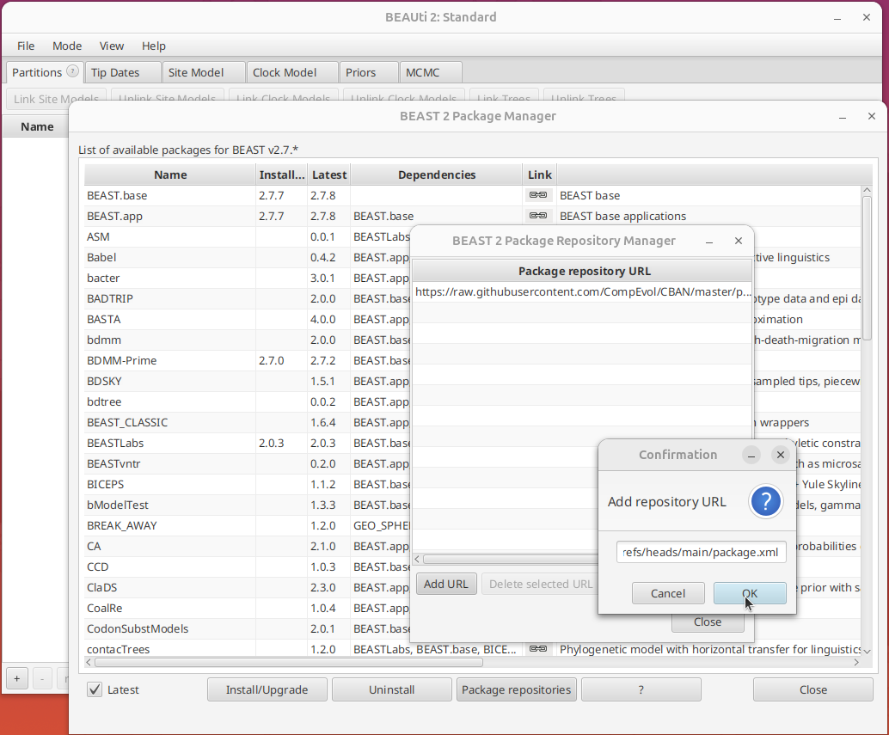

This tutorial explains how to use the **SuperSpreader** package for BEAST2. The package extends the BDMM-Prime parametrization to model heterogeneous transmission through two host types:

- **NS**: normal spreaders (standard transmission)
- **SS**: superspreaders (amplified transmission)

The model is defined by three epidemiological parameters:

- the average effective reproduction number ($R_e$)
- the proportion of superspreaders ($f_{ss}$)
- the relative transmission advantage of superspreaders ($\mathcal{T}_a$)

---

# Installation

Install the package through the BEAUti package manager.

1. Open BEAUti
2. Go to `File > Manage Packages`
3. Click `Package repositories`
4. Add the SuperSpreader package repository URL: <https://raw.githubusercontent.com/EDIDPasteur/Beast2-SuperSpreader/refs/heads/main/package.xml>
5. Select the package from the list and install it
6. Restart BEAUti

> If BDMM-Prime is not already installed, the package manager will download it automatically.

{width=80%}

---

# Data importation

1. Open the `Partitions` tab
2. Click `Import Alignment`
3. Select your sequence file

---

# Tip dates, site model and clock model

Before configuring the SuperSpreader model, set up the tip dates, substitution model and molecular clock as you would for any standard BEAST2 analysis. The SuperSpreader package does not introduce any changes to these settings. They are configured in the usual `Tip Dates`, `Site Model` and `Clock Model` tabs.

---

# Model configuration

## Select the parameterization

In the **Priors** panel, select the **BDMM-Prime** tree prior. Then, in the BDMM-Prime model configuration, choose the **SuperSpreader** parametrization from the list of available parametrizations.

{width=80%}

## Epidemiological parameters

The SuperSpreader parametrization introduces three epidemiological parameters that replace the deme-specific reproductive numbers used in the standard BDMM-Prime model. Like other BDMM-Prime parameters, each of these can be defined as a single value or as a skyline with multiple intervals.

| BEAUti parameter | Symbol | Description | Constraint |
|---|---|---|---|
| `becomeUninfectiousRate` | $\delta$ | Rate at which individuals become uninfectious | $> 0$ |
| `samplingProportion` | $\rho$ | Sampling proportion | $[0, 1]$ |
| **SuperSpreader-specific** | &nbsp; | &nbsp; | &nbsp; |
| `Re Average` | $R_e$ | Average effective reproduction number | $> 0$ |
| `SSFrac` | $f_{ss}$ | Proportion of superspreaders | $[0, 1]$ |
| `Re Multiplier` | $\mathcal{T}_a$ | Relative transmission advantage of superspreaders | $\geq 1$ |

These three SuperSpreader parameters apply to the whole population rather than to individual demes. They are only defined for a two-type model, in this case `NS` and `SS`.

Default starting values satisfy the model constraints: `Re Multiplier` is initialized above 1, `SSFrac` between 0 and 1, and all rate parameters above 0.

{width=80%}

### Skyline values and common change times

When the skyline option is used, `Re Average`, `SSFrac` and `Re Multiplier` behave like standard BDMM-Prime skyline parameters: a value is estimated for each time interval. The specific feature of the SuperSpreader parametrization is that the change times delimiting these intervals are shared across all three parameters through the `Common Change Time` parameter. Consequently, the skyline boundaries are identical for `Re Average`, `SSFrac` and `Re Multiplier`, reducing the number of time parameters to estimate. The ages of these change times can themselves be inferred from the data.

### Fixed parameters

By default:

- `removalProb` is fixed to 1.0
- `migrationRate` is fixed to 1.0 → must be set to **0**

When using the SuperSpreader model, `migrationRate` should be set to **0** to remain consistent with the biological process being modelled. The two types (`NS` and `SS`) represent different transmission regimes within a single population, not separate demes between which individuals migrate. Type changes therefore occur only at transmission events, not through migration.

## Type trait set

Once the alignment is loaded, the SuperSpreader parametrization automatically creates a type trait set with two possible types:

- `NS` (normal spreaders)
- `SS` (superspreaders)

By default, every tip is set to **unknown** and its type is inferred by the MCMC. The initial type frequencies, set in the `Start Type Prior Probs` field, match the starting value of `SSFrac`. For example, if `SSFrac` starts at 0.1, the type frequencies are initialized to 90% NS and 10% SS.

If the type is known for some or all samples (for example from contact tracing or behavioural data), it can be provided either manually or extracted automatically from the sequence identifiers. The exact type names (`NS` for normal spreaders and `SS` for superspreaders) must be respected to avoid creating additional, unintended types.

{width=80%}

---

# Priors

The default priors are:

| Parameter | Prior | Hyperparameters |
|---|---|---|
| `Re Average` | OneOnX | — |
| `SSFrac` | Beta | $\alpha = 1.0$, $\beta = 1.0$ |
| `Re Multiplier` | Exponential | mean = 10.0 |
| `samplingProportion` | Uniform | lower = 0.0, upper = 1.0 |
| `becomeUninfectiousRate` | OneOnX | — |
| `Common Change Time` | Fixed | value = 1.0, range [0.0, 10.0] |

---

# Common errors

| Error | Solution |
|---|---|
| Types poorly defined | Ensure the type trait set contains exactly `NS` and `SS` |
| `Re Multiplier < 1` | Keep `Re Multiplier` $\geq 1$ |
| `SSFrac` outside [0,1] | Use a distribution supported on [0,1] |
| `migrationRate` not set to 0 | Set `migrationRate` to 0 and make sure that `estimate values` is unchecked |

---

## Next steps

Once you have configured the model, you can:

- Save your XML configuration and run your analysis
- Test the model with the [example dataset](test-analysis.qmd) provided

